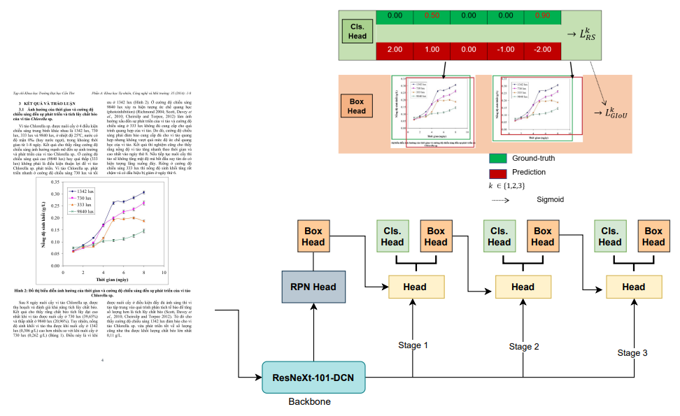

## CDeRSNet: Towards High Performance Object Detection in Vietnamese Documents Images

Contact us: [UIT-Together Research Group](https://uit-together.github.io/)




> **[CDeRSNet: Towards High Performance Object Detection in Vietnamese Documents Images (MMM'22)]()**            
> Thuan Trong Nguyen, Thuan Q. Nguyen, Long Duong, Nguyen D.Vo, Khang Nguyen        
<!-- > arXiv preprint ([arXiv:2103.07733](https://arxiv.org/pdf/2103.07733.pdf)) / CVPR [Open access](https://openaccess.thecvf.com/content/CVPR2021/papers/Han_ReDet_A_Rotation-Equivariant_Detector_for_Aerial_Object_Detection_CVPR_2021_paper.pdf). -->

The repo is based on [RankSortLoss](https://github.com/kemaloksuz/RankSortLoss) and [MMDetection](https://github.com/open-mmlab/mmdetection).


## Introduction

This project provides an implementation for our [MMM 2022](http://mmm2022.org/) paper "[CDeRSNet: Towards High Performance Object Detection in Vietnamese Documents Images].

In recent years, document image understanding (DIU) has received much attention from the research community. Localizing page objects (tables, figures, equations) in document images is an important problem in DIU, which is the foundation for extracting information from document images. However, it has remained many challenges due to the high degree of intra-class variability in page document. Especially, object detection in Vietnamese image documents has still limited. In this paper, we propose CDeRSNet: a novel end-to-end trainable deep learning network to solve object detection in Vietnamese documents.  The proposed network consists of Cascade R-CNN with the ResNeXt-101-DCN as the backbone and takes RS loss to complement the GIoU loss function.  CDeRSNet detects objects varying in scale with high detection accuracy at a higher IoU threshold to localize objects that differ in scale with detection accuracy at high quality. The experiment results demonstrate the effectiveness of the proposed method.

## Installation
Please refer to [INSTALL.md](https://mmdetection.readthedocs.io/en/v1.2.0/INSTALL.html) for installation and dataset preparation.

## Dataset
We empirically evaluate CDeRSNet on the Vietnamese image document dataset - [**UIT-DODV**](https://github.com/nguyenvd-uit/uit-together-dataset/blob/main/UIT-DODV.md)  with four classes of objects: table, figure, caption, and formula.


## Getting Started
Please see [GETTING_STARTED.md](https://mmdetection.readthedocs.io/en/v1.2.0/GETTING_STARTED.html) for the basic usage.
We use 2 GPUs (12GB RTX 2080 Ti) to train our detector, you can adjust the batch size in configs by yourselves.
* Train & Test
```shell
# Train
CUDA_VISIBLE_DEVICES=0,1 PORT=29500 bash tools/dist_train.sh configs/cdersnet/cdersnet.py 2

# Test
CUDA_VISIBLE_DEVICES=0,1 PORT=29500 bash tools/dist_test.sh configs/cdersnet/cdersnet.py work_dirs/cdersnet/best_bbox_mAP.pth 2 --eval bbox --options "classwise=True"
```

## Model and Results
Results on testing set of UIT-DODV.

| Method | Table | Figure | Formula| Caption| AP@.5 | AP@.75 |mAP |
| :----: | :------: | :-----: | :---------: | :--------------: | :------: | :------: | :------: |
| [Cascade R-CNN X-101](configs/cdersnet/cascade_rcnn_x101.py) | 94.4 |  83.3  | 46.3 | 73.1| 88.4 | 81.5 | 74.3 |
| [Cascade R-CNN X-101 DCN](configs/cdersnet/cascade_rcnn_x101_dcn.py) | 95.2 |  85.0  | 47.3 | 74.6| 88.1 | 82.6 | 75.5 |
| [Cascade R-CNN X-101 DCN Dynamic](configs/cdersnet/cascade_rcnn_x101_dcn_dynamic.py) | 94.9 |  85.2  | 50.7 | 75.2| 89.1 | 84.0 | 76.5 |
| [Cascade R-CNN X-101 DCN Dynamic RSLoss](configs/cdersnet/cascade_rcnn_x101_dcn_rs_dynamic.py) | 96.2 |  87.6  | 56.3 | 76.0| 92.4 | 86.8 | 79.0 |
| [CDeRSNet](configs/cdersnet/cdersnet.py) | 96.4 |  88.7  | 58.1 | 76.3| 92.3 | 87.2 | 79.9 |


## Citation

If the project helps your research, please cite this paper.

```
@article{cdersnet,
  title={CDeRSNet: Towards High Performance Object Detection in Vietnamese Documents Images},
  author={Thuan Trong Nguyen, Thuan Q. Nguyen, Long Duong, Nguyen D.Vo, Khang Nguyen},
  booktitle={International Conference on Multimedia Modelling (MMM)},
  year={2022},
  organization={Springer}
}
```


